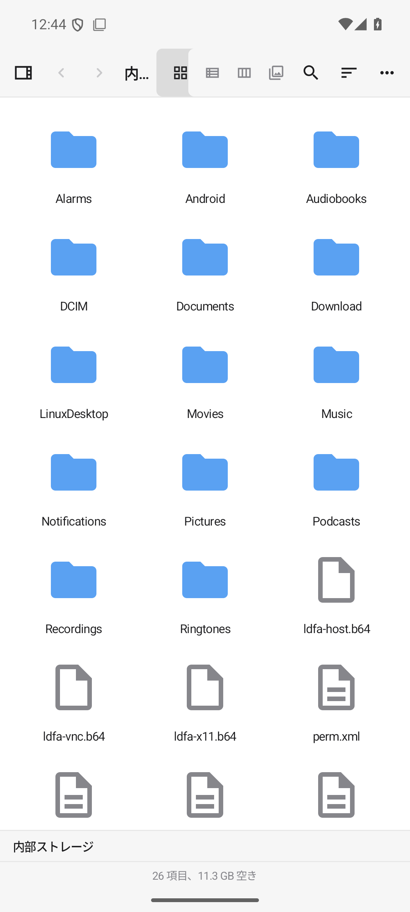
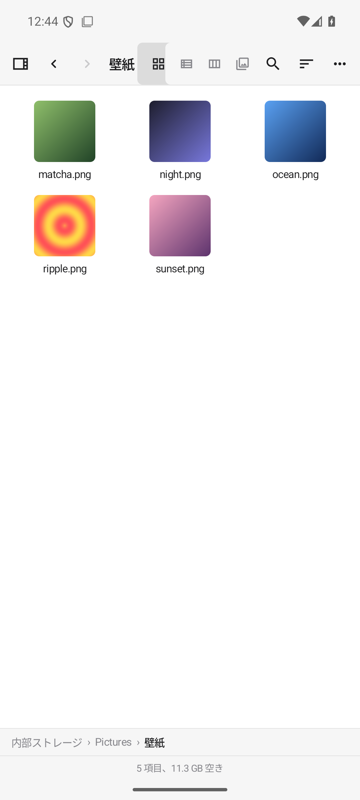
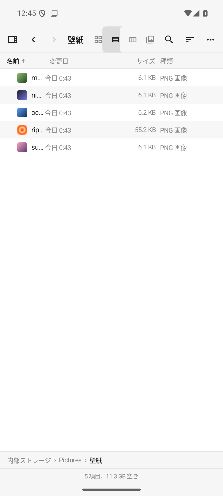
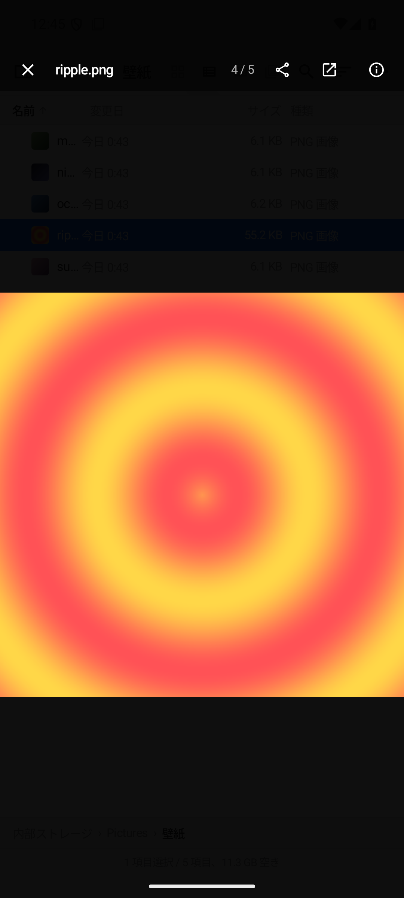
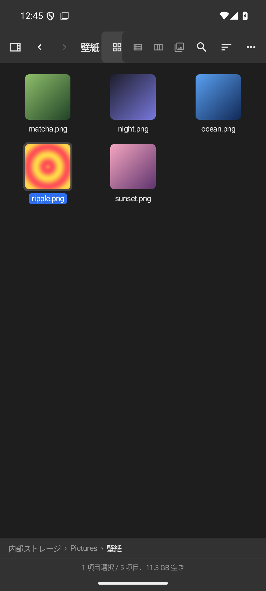

# dango 🍡

**macOS Finder の見た目・操作感・アニメーションを再現した Android ファイラー**

サイドバーと4つの表示モード、Quick Look 風プレビュー、圧縮・解凍、ネットワークドライブ接続まで、
「Finder がそのまま Android に来た」使い心地を目指しています。日本語 / 英語対応。

## スクリーンショット

| アイコン表示 | サムネイル | リスト表示 |
|:---:|:---:|:---:|
|  |  |  |

| Quick Look | ダークモード |
|:---:|:---:|
|  |  |

## 主な機能

### Finder 風のブラウズ
- サイドバー（よく使う項目・場所・ネットワーク・タグ）— 縦持ちはスライドイン、横持ち/タブレットは常時表示
- **アイコン / リスト / カラム / ギャラリー** の4表示モード。ピンチでアイコンサイズを 48〜256dp に連続変更
- パスバー（各階層タップで移動・ドロップ対応）とステータスバー（項目数・空き容量・転送進捗）
- フォルダ開閉のズーム、選択ハイライト、貼り付けパルスなど Finder 由来のアニメーション一式
- Finder 配色トークンによるライト / ダークテーマ（Material You 動的カラーはオプション）

### ファイル操作
- 作成・インラインリネーム・一括リネーム（連番 / 検索置換 / 接頭尾辞）・コピー・移動・複製
- 同名衝突ダイアログ（両方残す / 置き換え / スキップ、以降すべてに適用）
- ゴミ箱（元に戻す / 30日自動削除）、削除直後のワンタップ取り消し
- ドラッグ&ドロップ移動（フォルダ・サイドバー・パスバーへ。ゴミ箱へドロップで削除）
- マウス右クリックのコンテキストメニュー（コピー / 切り取り / 貼り付け / すべて選択 / 共有 / リネーム / プレビュー / 情報 / タグ…）

### Quick Look プレビュー
- 画像（ピンチズーム・ダブルタップ拡大・下スワイプで閉じる）、GIF / SVG / HEIC 対応
- 動画・音声（Media3、倍速 0.5〜2x）、PDF（縦スクロール・ズーム・パスワード付き対応※）
- テキスト（文字コード自動判定 UTF-8 / Shift_JIS / EUC-JP、行番号）＋**簡易編集**
  （取り消し / やり直し・検索置換・改行コード選択・原子的保存）
- 情報ウィンドウ: サイズ（フォルダは非同期集計）・作成/変更日・アクセス権・MD5/SHA-256・EXIF・メディア情報

### 圧縮・解凍
- 解凍: zip（AES / ZipCrypto）・7z（暗号化対応）・tar / tar.gz / tar.bz2 / tar.xz / tar.zst・gz / bz2 / xz / zst・rar（読み取り）
- zip エントリ名の文字化け対策（UTF-8 → Shift_JIS → CP437 自動判定＋手動指定）
- **アーカイブ内ブラウズ**（展開せずに閲覧・個別プレビュー・書き出し）
- 圧縮: zip（AES-256 パスワード・レベル選択）/ tar.gz / 7z
- Zip Slip 対策・空き容量の事前チェック・進捗通知とキャンセル

### ネットワークドライブ
- **SMB2/3・SFTP・WebDAV・FTP** に接続（NAS、Samba、Nextcloud、Tailscale 経由の SSH サーバなど）
- 資格情報は Android Keystore で暗号化保存（保存しない選択も可）、SSH ホスト鍵は TOFU 検証
- ローカル ⇔ ネットワークのコピー / 移動、プレビューの一時ダウンロード（上限 1GB の自動整理）

### その他
- インクリメンタル検索（現在フォルダ / デバイス全体）
- タグ 7色（右クリックで付与、サイドバーから横断検索）
- 起動時の生体認証ロック、設定画面（テーマ / シングルタップで開く / ゴミ箱自動削除ほか）

## インストール

[**Releases**](https://github.com/hatake716/dango/releases) から最新の APK をダウンロードしてインストールしてください。

- 対応: Android 11（API 30）以上。主要検証端末は Pixel（Android 16）
- 初回起動時に「すべてのファイルへのアクセス」を推奨として求めます（拒否しても制限付きの通常モードで動作）

## ビルド

```bash
git clone https://github.com/hatake716/dango.git
cd dango
./gradlew assembleDebug
# → app/build/outputs/apk/debug/app-debug.apk
```

リリースビルドはリポジトリ直下に `keystore.properties`（`storeFile` / `storePassword` / `keyAlias` / `keyPassword`）を置くと署名されます。

## 技術スタック

Kotlin 2.2 / Jetpack Compose + Material 3 / MVVM + Repository（単一 Activity）/ Room / DataStore /
Coil 3 / Media3 / zip4j・commons-compress・junrar / smbj・sshj・sardine-android・commons-net

詳細な仕様は [docs/SPEC.md](docs/SPEC.md)、開発の経緯と既知の制限は [docs/PROGRESS.md](docs/PROGRESS.md) を参照してください。

## 既知の制限（v1.0）

- RAR5 の読み取り、7z の暗号化付き作成は未対応（ライブラリ制約。詳細は SPEC §15）
- パスワード付き PDF は Android 15 以降で対応
- mDNS によるサーバ自動検出・SFTP の秘密鍵認証は今後対応予定

## 開発

Claude Code で作業する場合は [CLAUDE.md](CLAUDE.md) を先に読んでください。
